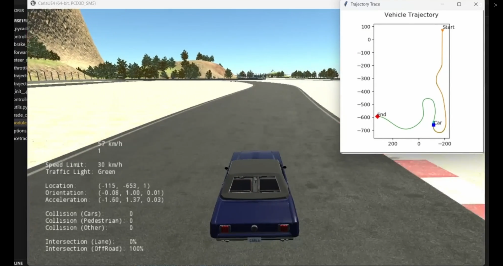

## Cruise Control and Lane Keeping System in an Autonomous Car (CARLA Simulator)

This project demonstrates a Cruise Control and Lane Keeping System for an autonomous vehicle using the CARLA simulator. It combines longitudinal control (cruise control) and lateral control (lane keeping) to follow a pre-defined trajectory of waypoints in a simulated urban or racetrack environment.

# Objective
Develop and test a modular control system that allows a simulated vehicle to:
-Maintain a desired speed profile (Cruise Control)
-Follow a given lane trajectory accurately (Lane Keeping)

The system is implemented in Python and interfaces with CARLA to control a vehicle in real-time.

# How It Works
1. Waypoint Loading
A set of [x, y, speed] waypoints are loaded from racetrack_waypoints.txt, representing the desired path and target speeds along the route.

2. Linear Interpolation
To smoothen the path and provide more control points, the original sparse waypoints are interpolated into a denser trajectory.

3. Controller Design
Control logic is defined in controller2d.py, which implements:

- Cruise Control: Adjusts throttle and brake to maintain the target speed

- Lane Keeping: Adjusts steering angle to minimize lateral error from the desired path

4. Simulation Loop
At each simulation frame:

- Vehicle's position, speed, and heading are read

- Closest waypoint is identified

- Control commands (steering, throttle, brake) are calculated

- CARLA vehicle is updated with these commands

- Results are logged and optionally plotted live

# Output & Visualization
Results are saved in the controller_output/ directory:

- trajectory.png: Path followed vs. reference waypoints

- forward_speed.png: Target speed vs. actual speed

- throttle_output.png, brake_output.png, steer_output.png: Control command timelines

- trajectory.txt: Time-stamped pose and speed logs

# Technical Background
This project mimics real-world autonomous driving modules:
- Cruise Control is implemented as a longitudinal controller that regulates vehicle speed based on the difference between target and actual speed.
- Lane Keeping Assist (LKA) is handled by a lateral controller that minimizes cross-track error and heading error using geometric or feedback-based control.

The system can be expanded to include more realistic sensing, dynamic obstacle avoidance, and path planning.

